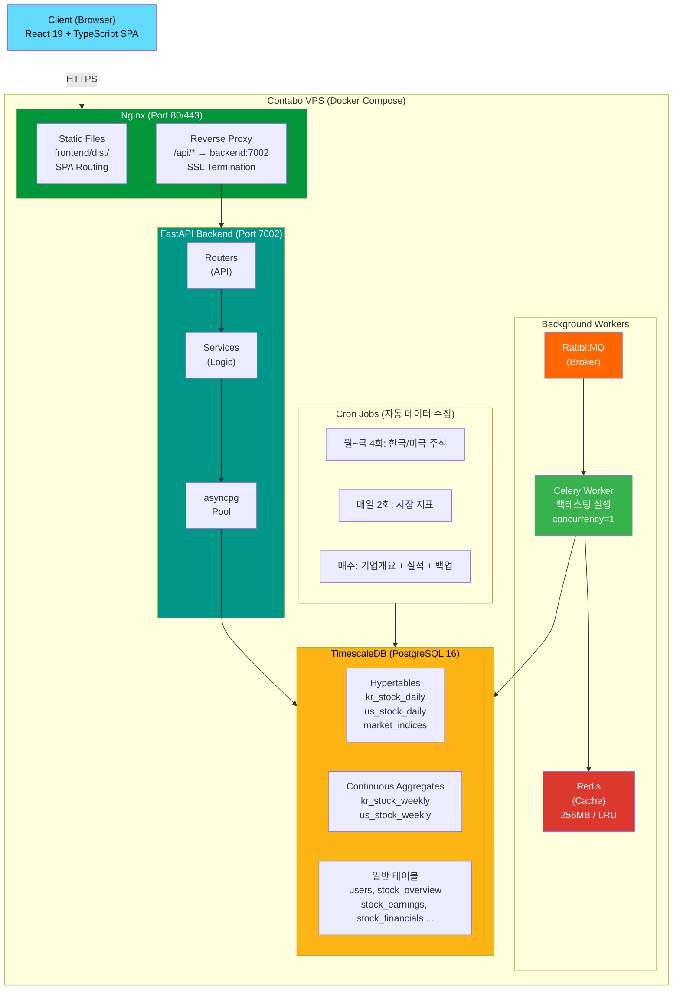
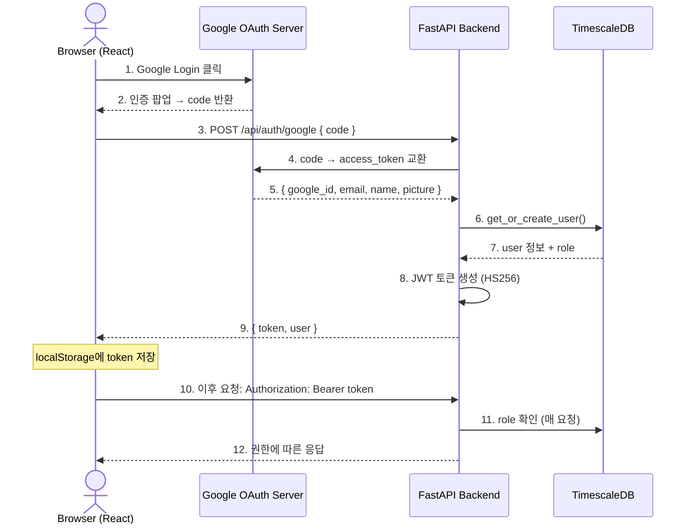
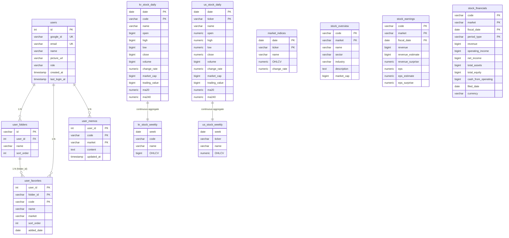
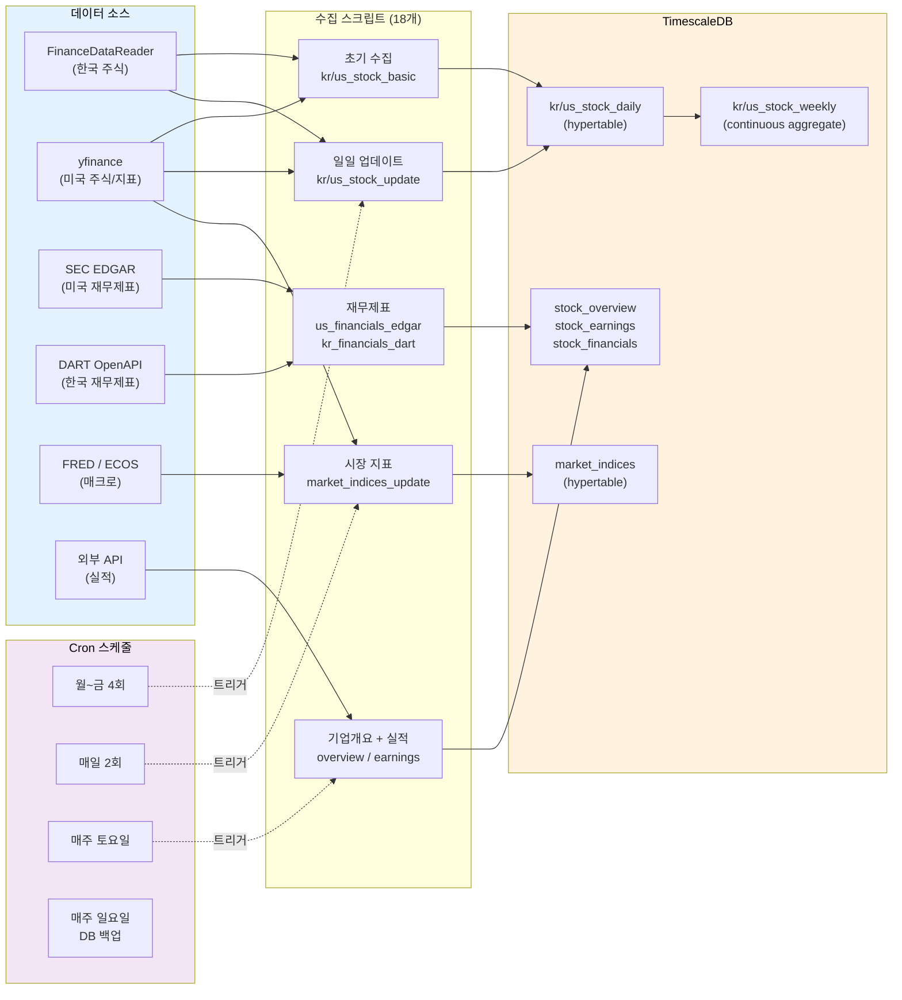
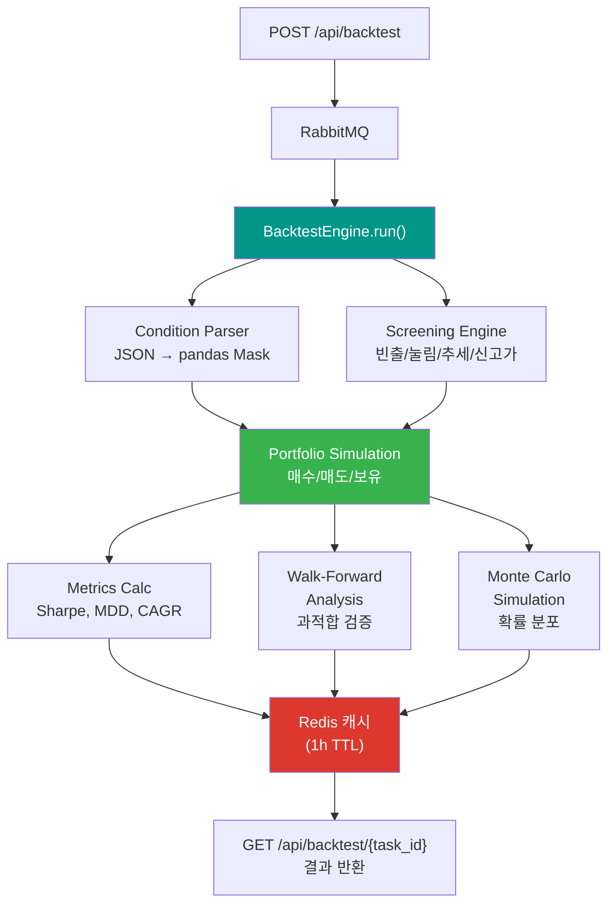
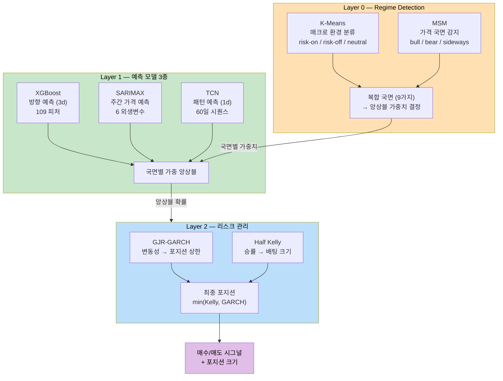

# ANTenna - Stock Analysis & Backtesting Platform

<div align="center">
  

  <p><strong>개미 투자자를 위한 주식 분석 플랫폼, ANTenna</strong></p>
  <p><em>한국/미국 주식 데이터 분석, 백테스팅, 통계 + AI 퀀트 모델링</em></p>

  
  
  
  
  
  
  
  
  
  

  **[Visit Site](https://antenna-stock.duckdns.org)**
</div>

---

## 목차

1. [Overview](#1-overview) - 개요
2. [Preview](#2-preview) - 미리보기
3. [Background](#3-background) - 개발 배경
4. [Features](#4-features) - 주요 기능
5. [Tech Stack](#5-tech-stack) - 기술 스택
6. [Architecture](#6-architecture) - 시스템 아키텍처
7. [Database Design](#7-database-design) - 데이터베이스 설계
8. [Data Pipeline](#8-data-pipeline) - 데이터 수집 파이프라인
9. [Backtesting Engine](#9-backtesting-engine) - 백테스팅 엔진
10. [Quant Modeling Strategy](#10-quant-modeling-strategy) - 통계 + AI 퀀트 모델링
11. [Project Structure](#11-project-structure) - 프로젝트 구조
12. [API Endpoints](#12-api-endpoints) - API 엔드포인트
13. [Deployment](#13-deployment) - 배포
14. [License](#14-license) - 라이선스

---

## 1. Overview

**ANTenna**는 한국(KOSPI/KOSDAQ) 및 미국(NYSE/NASDAQ) 주식 시장의 과거 데이터를 캘린더 기반으로 조회하고, 다양한 스크리닝·백테스팅·차트 분석 기능을 제공하는 **풀스택 주식 분석 플랫폼**입니다.

2011년부터 현재까지 약 **2,240만 건**의 일봉 데이터를 (2025.03 기준) TimescaleDB에 저장하고, 크론잡을 통해 매일 자동으로 수집·갱신합니다. Google OAuth 인증, 즐겨찾기/메모, 규칙 기반 백테스팅 등 실사용 가능한 기능을 갖추고 있으며, Contabo VPS에 Docker Compose로 배포되어 운영 중입니다.

### 핵심 수치

| 항목 | 규모 |
|------|------|
| 한국 주식 일봉 | ~7,175,000건 (2011년부터 현재까지) |
| 미국 주식 일봉 | ~15,238,000건 (2011년부터 현재까지) |
| 시장 지표 | 23개 (지수, 금리, CPI, GDP, 실업률, 환율, 원자재, 암호화폐) |
| 재무제표 | ~332,000건+ (분기/연간, 미국+한국) |
| 실적 서프라이즈 | ~222,000건+ |
| 종목 수 | 한국 ~2,650+ / 미국 ~6,790+ |

---

## 2. Preview

<div align="center">

https://github.com/user-attachments/assets/93b75060-98a9-4989-bc0a-52b2b5ec3298

  <p><i>ANTenna 시연 영상</i></p>
</div>

---

## 3. Background

기존 증권사 HTS/MTS의 한계를 해결하기 위해 개발되었습니다.

### 기존 서비스의 한계

| 문제점 | 설명 |
|--------|------|
| **과거 데이터 조회 불가** | 과거 특정 날짜의 거래대금/상승률 상위 종목을 조회할 수 없음. 당일 데이터만 제공 |
| **조건 검색의 시간적 제약** | 조건 검색이 당일 기준으로만 가능. 과거 시점 기반 백테스팅 불가 |
| **고급 필터링의 높은 진입장벽** | HTS에 조건 검색 기능이 존재하지만, 설정이 복잡하여 지식이 풍부한 투자자가 아니면 조건을 조합해 활용하기 어려움 |
| **과도한 기능으로 인한 혼란** | 기존 서비스는 너무 많은 기능을 제공하여, 초보 투자자가 어떤 기능을 효과적으로 활용해야 하는지 파악하기 어려움 |

### ANTenna의 해결 방안

- **캘린더 기반 과거 데이터 조회** — 원하는 날짜를 선택하여 해당일의 상위 종목 데이터를 언제든지 확인
- **과거 조건 검색 및 분석** — 빈출 종목, 눌림목, 연속 상승, 52주 신고가 등의 분석을 과거 데이터 기반으로 수행
- **다단계 고급 필터링** — 갭 분석, 이동평균선 위치, 가격대 등 다양한 조건을 조합한 종목 스크리닝
- **핵심 기능에 집중한 UI** — 초보 투자자도 바로 활용할 수 있도록 핵심 분석 기능만 선별하여 직관적으로 제공
- **규칙 기반 백테스팅** — 기술적 지표 조건을 설정하여 과거 수익률을 시뮬레이션
- **퀀트 모델링** — 5개 모델(XGBoost + TCN + SARIMAX + GJR-GARCH + Regime) 앙상블, 국면별 가중치 최적화, Walk-Forward 검증 완료 (3개월 백테스트: 수익률 +32.4%, 승률 56.8%, Sharpe 2.15)

### ANTenna의 가치

단기 주가는 기업의 내재가치보다 실적 발표, 뉴스, 테마 등 **이벤트가 트리거**가 되어, 시장 참여자들의 **심리적 요인**과 **수급의 흐름**에 따라 움직이는 경향이 강합니다.

| 투자 성향 | 활용 방안 |
|----------|----------|
| **주식 초보자** | 핵심 기능만 선별된 직관적 인터페이스로 빠르게 시장 흐름 파악 |
| **단기 트레이더** | 거래대금 급증, 연속 상승, 갭 발생 등의 시그널을 통해 모멘텀 종목 발굴 및 매매 타이밍 포착 |
| **장기 투자자** | 관심 종목의 과거 패턴 분석을 통해 적절한 매수 가격대와 진입 시점을 판단 |
| **퀀트 투자자** | 백테스팅으로 전략 검증, Walk-Forward 분석으로 과적합 방지 |

---

## 4. Features

### 4.1 캘린더 기반 주식 데이터 조회

- **날짜별 상위 종목** — 거래대금/상승률 기준 상위 300개 종목 조회
- **가격대별 필터링** — 미국주식: $10 이상 / $5~$10 / $5 미만 구분
- **3단계 정렬** — 컬럼 클릭 시 내림차순 → 오름차순 → 정렬 해제 순환
- **실시간 검색** — 종목코드/이름 자동완성 검색 (한국어/영어)

### 4.2 종목 스크리닝 분석

| 분석 유형 | 설명 |
|----------|------|
| **빈출 종목** | 최근 N주간 상위 300위에 자주 등장한 종목 순위 |
| **눌림목 종목** | N일 전 상승 후 현재 하락 중인 종목 탐지 |
| **연속 상승 종목** | 2~4일 연속 상승 중인 종목 필터링 |
| **52주 신고가** | 52주 최고가를 돌파한 종목 |
| **갭 상승/하락 분석** | 3단계 필터링 (기준/추가기준/세부기준) + MA240 위치 표시 |
| **신규 상장** | IPO 종목 목록 및 상장 이후 수익률 추이 |

### 4.3 차트 기능

- **라인 차트** — 종가 추이 시각화
- **캔들 차트** — OHLC 데이터 (양봉: 빨강, 음봉: 파랑)
- **거래대금 차트** — 상승/하락일 색상 구분
- **이동평균선** — 20일선, 240일선 토글
- **주봉/월봉 전환** — 일봉 → 주봉 → 월봉 자동 집계
- **기업 개요/실적** — 섹터, EPS, 실적 서프라이즈 표시
- **재무제표** — 손익계산서/재무상태표/현금흐름표 (연간/분기, YoY 변동률, 가로 스크롤)

### 4.4 백테스팅

- **스크리닝 기반 백테스팅** — 빈출 종목, 눌림목 등 스크리닝 결과를 매수 신호로 활용
- **Walk-Forward 분석** — 롤링 윈도우 방식으로 과적합 검증
- **Monte Carlo 시뮬레이션** — 확률적 수익률 분포 추정
- **성과 지표** — Sharpe Ratio, Sortino Ratio, MDD, CAGR, 승률, 손익비 등

### 4.5 사용자 기능 (Google OAuth)

- **Google 로그인** — OAuth 2.0 기반 인증
- **폴더 관리** — 생성/삭제/이름변경/순서변경
- **즐겨찾기** — 폴더별 종목 관리, 종가/등락률/거래대금 표시, 다양한 기준으로 정렬
- **종목 메모** — 종목별 메모 저장 및 조회
- **권한 관리** — admin이 사용자별 역할(admin/premium/user) 직접 변경

### 4.6 홈페이지 대시보드

- **시장 지수 카드** — KOSPI, KOSDAQ, S&P 500, NASDAQ 실시간 현황
- **매크로 지표** — 금리, CPI, 환율, 원자재, 암호화폐 등 23개 지표

---

## 5. Tech Stack

### Frontend

| 기술 | 용도 |
|------|------|
| **React 19** | UI 컴포넌트 라이브러리 |
| **TypeScript** | 정적 타입 시스템 |
| **Vite** | 차세대 빌드 도구 |
| **TailwindCSS** | 유틸리티 기반 스타일링 |
| **TanStack Query** (React Query) | 서버 상태 관리 및 캐싱 |
| **Lightweight Charts** | TradingView 금융 차트 라이브러리 |
| **Axios** | HTTP 클라이언트 |
| **KaTeX** | 수학 수식 렌더링 (백테스팅 결과) |

### Backend

| 기술 | 용도 |
|------|------|
| **FastAPI** | 고성능 비동기 웹 프레임워크 |
| **Uvicorn** | ASGI 서버 |
| **Celery** | 비동기 백테스팅 작업 큐 |
| **RabbitMQ** | 메시지 브로커 |
| **Redis** | 백테스팅 결과 캐시 (maxmemory 256MB) |
| **Pandas / NumPy** | 데이터 처리 및 수치 연산 |
| **python-jose** | JWT 토큰 생성/검증 |

### Database

| 기술 | 용도 |
|------|------|
| **TimescaleDB** (PostgreSQL 16) | 시계열 최적화 데이터베이스 |
| **asyncpg** | PostgreSQL 비동기 드라이버 |

### Infrastructure

| 기술 | 용도 |
|------|------|
| **Docker Compose** | 6개 서비스 오케스트레이션 |
| **Nginx** | 리버스 프록시 + 정적 파일 서빙 |
| **Let's Encrypt** | SSL 인증서 (HTTPS) |
| **Contabo VPS** | 호스팅 (4 vCPU / 8GB RAM / 75GB NVMe) |
| **DuckDNS** | 무료 동적 DNS |
| **GitHub Actions** | CI/CD 파이프라인 |

### 데이터 수집

| 기술 | 용도 |
|------|------|
| **FinanceDataReader** | 한국 주식 데이터 수집 |
| **yfinance** | 미국 주식 / 시장 지표 수집 |
| **SEC EDGAR API** | 미국 재무제표 (XBRL → JSON) |
| **DART OpenAPI** | 한국 재무제표 (금융감독원 전자공시) |
| **FRED API** | 미국 매크로 지표 (금리, CPI, 실업률, GDP) |
| **ECOS API** | 한국 매크로 지표 |

---

## 6. Architecture

### 6.1 전체 시스템 구성



### 6.2 Docker Compose 서비스 구성

| 서비스 | 이미지 | 역할 | 리소스 |
|--------|--------|------|--------|
| **backend** | python:3.11-slim | FastAPI API 서버 | ~300-400MB |
| **db** | timescale/timescaledb:pg16 | 시계열 데이터베이스 | ~1-1.5GB |
| **nginx** | nginx:alpine | 리버스 프록시 + SSL + 정적 파일 | ~50MB |
| **celery-worker** | python:3.11-slim | 백테스팅 비동기 실행 | ~200MB (대기) / ~1GB (실행) |
| **rabbitmq** | rabbitmq:3-management-alpine | 메시지 브로커 | ~150-200MB |
| **redis** | redis:7-alpine | 결과 캐시 | ~100-256MB |

> **총 메모리**: 평소 ~3.5GB / 피크 ~5.5GB → 8GB RAM + 4GB swap으로 충분

### 6.3 인증 흐름



| 역할 | 권한 |
|------|------|
| **anonymous** | 데이터 조회, 차트, 스크리닝 (읽기 전용) |
| **user** | + 즐겨찾기, 메모, 폴더 관리 |
| **premium** | + 백테스팅 (지표/스크리닝 모드) |
| **admin** | + 사용자 역할 관리 |

---

## 7. Database Design

### 7.1 ERD



### 7.2 TimescaleDB 활용

일반 PostgreSQL 테이블을 **시계열 데이터에 최적화**되도록 내부적으로 자동 파티셔닝:

```
Hypertable (가상의 단일 테이블):
  kr_stock_daily
    ├── _hyper_1_1_chunk   (기간 A)  →  59만 행
    ├── _hyper_1_2_chunk   (기간 B)  →  62만 행
    └── ...

→ "삼성전자 최근 1년" 조회 시 617만 행 전체가 아닌 해당 기간 chunk만 스캔
→ 90일 이전 데이터 자동 압축 (70-80% 디스크 절약)
```

---

## 8. Data Pipeline

### 8.1 데이터 소스

| 카테고리 | 소스 | 수집 대상 |
|----------|------|-----------|
| 한국 주식 일봉 | FinanceDataReader | OHLCV, 시가총액, 거래대금 |
| 미국 주식 일봉 | yfinance | OHLCV, 시가총액, 거래대금 |
| 기업 개요 | 외부 API | 섹터, 산업, 기업 개요 |
| 실적 서프라이즈 | 외부 API | 미국: 매출/EPS, 한국: 매출/영업이익 실제 vs 예상 |
| 재무제표 (미국) | SEC EDGAR (XBRL) | 손익+재무상태+현금흐름 (분기/연간) |
| 재무제표 (한국) | DART OpenAPI | 손익+재무상태+현금흐름 (분기/연간) |
| 시장 지표 | yfinance / FRED / ECOS | 지수, 금리, CPI, GDP, 실업률, 환율, 원자재, 암호화폐 |

### 8.2 자동 수집 스케줄 (Cron)

| 시간 (KST) | 대상 | 빈도 |
|------------|------|------|
| 10:30, 12:30, 14:30, 16:00 | 한국 주식 일봉 | 월~금 |
| 01:00, 02:00, 05:30, 06:30 | 미국 주식 일봉 | 화~토 |
| 07:00, 16:30 | 시장 지표 23개 | 매일 |
| 토요일 새벽 | 기업개요 → 실적 | 매주 |
| 일요일 01:00 | DB 전체 백업 (gzip) | 매주 |

### 8.3 수집 파이프라인 흐름



---

## 9. Backtesting Engine

자체 구현한 백테스팅 엔진으로, Zipline 등 외부 라이브러리 없이 순수 Python/Pandas로 작성되었습니다.

### 9.1 아키텍처



### 9.2 지원 기술적 지표

SMA, EMA, RSI, Bollinger Bands 등

### 9.3 조건 구문 (JSON)

```json
{
  "condition": "and",
  "rules": [
    { "indicator": "close", "operator": "cross_above", "operand": { "indicator": "ma20" } },
    { "indicator": "rsi", "operator": "gt", "operand": { "value": 30 } }
  ]
}
```

### 9.4 스크리닝 전략

#### 기본 조회

| 전략 | 설명 |
|------|------|
| **빈출** | 최근 N주간 상위 300위에 자주 등장한 종목을 매수 신호로 활용 |
| **눌림목** | N일 전 상승 후 현재 하락 중인 종목의 반등을 노린 매수 |
| **연속 상승** | N일 연속 상승 중인 종목의 모멘텀 추종 매수 |
| **52주 신고가** | 52주 최고가를 돌파한 종목의 추세 추종 매수 |

#### 고급 조회

| 전략 | 설명 |
|------|------|
| **갭 상승** | 전일 종가 대비 갭 상승한 종목 매수 (52주 신고가 필터 옵션) |
| **갭 하락 후 반등** | 갭 하락 발생 후 반등 기회를 노린 매수 |
| **신규 상장** | IPO 종목의 상장 이후 수익률 기반 매수 |

#### 공통 필터

- **MA240 필터** — 전체 / 정배열(MA240 위) / 역배열(MA240 아래)
- **가격대 필터** (미국주식) — 전체 / $10 이상 / $5~$10 / $5 미만

### 9.5 성과 지표

#### 기본 지표

| 지표 | 설명 |
|------|------|
| 총 수익률 | 전체 기간 누적 수익률 |
| 총 거래 수 | 발생한 전체 거래 건수 |
| CAGR | 연평균 복리 수익률 |
| 승률 | 수익 거래 / 전체 거래 비율 |
| Sharpe Ratio | 수익률 / 변동성 (위험 대비 수익) |
| Sortino Ratio | 수익률 / 하방 변동성 (하락 위험만 고려) |
| MDD | 최대 낙폭 (고점 대비 최대 손실) |
| Volatility | 연 환산 변동성 (수익률의 흔들림 정도) |
| Calmar Ratio | CAGR / MDD (위험 대비 수익 효율) |
| Profit Factor | 총수익 / 총손실 |
| 건당 기대값 (EV) | (승률 × 평균수익) - (패율 × 평균손실) |

#### Walk-Forward 분석

| 지표 | 설명 |
|------|------|
| In-sample 평균 | 훈련 구간 평균 수익률 |
| Out-of-sample 평균 | 검증 구간 평균 수익률 (실전 유사 성과) |
| 과적합 갭 | In-sample과 Out-of-sample 차이 |

#### Monte Carlo 시뮬레이션

| 지표 | 설명 |
|------|------|
| 중앙값 | 시뮬레이션 결과의 중앙값 (현실적 기대치) |
| 손실 확률 | 원금 손실로 끝나는 시뮬레이션 비율 |
| 최선 케이스 (95%) | 상위 5% 시나리오 수익률 |
| 최악 케이스 (5%) | 하위 5% 시나리오 수익률 |

---

## 10. Quant Modeling Strategy

> 5개 모델 앙상블 + 국면별 가중치 최적화 완료. Walk-Forward 검증 및 백테스팅 결과 확보.
> 학습: RunPod RTX 4090 / 추론: Contabo VPS (CPU)

### 10.1 백테스팅 결과

**3개월 Out-of-Sample (2025-10 ~ 2026-01, 64거래일):**

| 전략 | 수익률 | 승률 | Sharpe | MDD | 거래 수 |
|------|--------|------|--------|-----|---------|
| Global 가중치 | +18.2% | 52.9% | 1.38 | -22.5% | 596건 |
| **Per-regime (국면별 최적)** | **+32.4%** | **56.8%** | **2.15** | **-18.3%** | **308건** |

> 조건: 상위 10종목, 3일 보유, 매일 리밸런싱, $10↑, 거래비용 0.1% 편도, 초기 $100,000

<div align="center">
  
  <p><i>AI 모델 시그널 대시보드 — 시장 국면, 앙상블 확률, 시그널 표시</i></p>
</div>

### 10.2 모델 아키텍처 (5개 모델 앙상블)



| 모델 | 역할 | 타겟 | 입력 |
|------|------|------|------|
| **XGBoost** | 종목별 방향 예측 | 3일 후 상승 확률 | 109개 피처 (Level 0~8) |
| **TCN** | 시퀀스 패턴 예측 | 1일 후 상승 확률 | 21개 피처 → PCA 17개, 60일 윈도우 |
| **SARIMAX** | 주간 가격 추세 | 다음 주 예측가 | 6개 외생변수 (VIF+PFI 선별) |
| **GJR-GARCH** | 변동성 예측 | 포지션 스케일 | target_vol 15% / predicted_vol |
| **Regime** | 시장 국면 감지 | 앙상블 가중치 | K-Means(매크로 6개) × MSM(주간 수익률) |

### 10.3 피처 설계 (109개)

| 계층 | 피처 수 | 내용 |
|------|---------|------|
| **Level 0** — 현재 상태 | 13개 | return, volatility, rsi, bb, ma, volume, market_cap |
| **Level 1** — 추세 변화 | 10개 | rsi/volume/volatility/bb/ma 변화율 |
| **Level 2** — 가격 구조 | 11개 | drawdown, recovery, consecutive, atr, gap |
| **Level 3** — 모멘텀 | 14개 | return_accel, macd, ma_alignment, roc, stochastic |
| **Level 4** — 거래량-가격 | 5개 | vol_price_corr, obv, volume_spike |
| **Level 5** — 시장 대비 | 5개 | alpha, beta, correlation_sp500 |
| **Level 6** — 돌파 감지 | 8개 | dist_52w, new_high, resistance, bb_squeeze |
| **Level 7** — 밸류에이션 | 4개 | earnings/book/revenue/ocf yield |
| **Level 8** — 통계 | 5개 | skew, kurtosis, autocorr, amihud, turnover |
| **갭 파생** | 4개 | gap_volume_combo, gap_fill, large_gap, overnight_return |
| **재무(Fund)** | 20개 | 분기(Q) 10개 + 연간(FY) 10개 |
| **매크로(Macro)** | 8개 | 금리, CPI, 달러, 유가, 금, 비트코인, VIX, 금리차 |
| **서프라이즈** | 2개 | eps_surprise, revenue_surprise |

### 10.4 학습 방식

- **Walk-Forward 검증** — 46개 윈도우, Train 3년 / Val 6개월 / Test 3개월 슬라이딩
- **데이터**: 14M행 × 109 피처 (2011~현재, 미국 ~6,000종목)
- **학습 환경**: RunPod RTX 4090 / **추론 환경**: Contabo VPS CPU
- **국면별 가중치 최적화**: 77개 후보 그리드서치, 국면별 XGB/SAR/TCN 비율 자동 결정

### 10.5 향후 확장

- **지수 방향 예측 모델** — S&P 500/NASDAQ 내일 방향 예측 (LightGBM + Breadth 피처), Regime 보강판으로 활용
- **NLP 감성 분석** — 뉴스/소셜 미디어 + FinBERT로 감성 피처 생성
- **RAG** — 과거 유사 이벤트 검색 + 예측 근거 설명 생성

---

## 11. Project Structure

```
ANTenna/
├── backend/
│   ├── main.py                    # FastAPI 진입점, SPA 라우팅
│   ├── config.py                  # 환경설정 (DB, JWT, OAuth 등)
│   ├── celery_app.py              # Celery 설정 (RabbitMQ + Redis)
│   ├── Dockerfile                 # Python 3.11 컨테이너
│   ├── requirements.txt           # Python 의존성
│   │
│   ├── routers/                   # API 엔드포인트
│   │   ├── kr_stock.py            #   한국 주식 API
│   │   ├── us_stock.py            #   미국 주식 API
│   │   ├── market_indices.py      #   시장 지표 API
│   │   ├── backtest.py            #   백테스팅 API
│   │   ├── quant.py               #   퀀트 시그널 API
│   │   ├── auth.py                #   Google OAuth API
│   │   ├── admin.py               #   관리자 API
│   │   └── user.py                #   사용자 데이터 API
│   │
│   ├── services/                  # 비즈니스 로직
│   │   ├── data_manager.py        #   주식 데이터 처리 (asyncpg)
│   │   ├── user_manager.py        #   사용자 데이터 관리
│   │   └── auth_service.py        #   OAuth + JWT
│   │
│   ├── models/
│   │   └── schemas.py             # Pydantic 데이터 스키마
│   │
│   ├── middleware/
│   │   └── auth_middleware.py      # 인증 미들웨어
│   │
│   ├── backtester/                # 규칙 기반 백테스팅 엔진
│   │   ├── engine.py              #   코어 백테스트 루프
│   │   ├── condition_parser.py    #   조건 JSON → pandas mask
│   │   ├── indicators.py          #   기술적 지표 (SMA, RSI, MACD 등)
│   │   ├── portfolio.py           #   포지션/손익 추적
│   │   ├── execution.py           #   주문 체결 시뮬레이션
│   │   ├── metrics.py             #   성과 지표 (Sharpe, MDD 등)
│   │   ├── walk_forward.py        #   Walk-Forward 분석
│   │   ├── monte_carlo.py         #   Monte Carlo 시뮬레이션
│   │   ├── screening_engine.py    #   스크리닝 기반 백테스트
│   │   ├── operators.py           #   비교 연산자
│   │   └── presets.py             #   프리셋 전략
│   │
│   ├── quant/                     # 퀀트 모델링 (gitignore)
│   │   ├── config.py              #   가중치, 필터, 하이퍼파라미터 설정
│   │   ├── data/
│   │   │   ├── loader.py          #   DB → DataFrame (TimescaleDB)
│   │   │   └── features.py        #   109개 피처 엔지니어링
│   │   ├── models/
│   │   │   ├── base.py            #   공통 인터페이스 (train/predict/save/load)
│   │   │   ├── xgboost_model.py   #   방향 예측
│   │   │   ├── tcn_model.py       #   시퀀스 패턴 예측 
│   │   │   ├── sarimax_model.py   #   주간 가격 추세 예측
│   │   │   ├── gjr_garch_model.py #   변동성 → 포지션 사이징
│   │   │   └── regime_model.py    #   시장 국면 감지 (KMeans+MSM)
│   │   ├── pipeline/
│   │   │   ├── trainer.py         #   Walk-Forward 학습 + 앙상블 추론
│   │   │   ├── combiner.py        #   국면별 가중 앙상블
│   │   │   └── backtester.py      #   퀀트 전용 백테스팅
│   │   └── ensemble/
│   │
│   ├── scripts/                   # 데이터 수집 스크립트 (21개)
│   │
│   ├── sql/
│   │   ├── init.sql               # DB 초기화 (hypertable, 인덱스)
│   │   └── add_market_indices.sql  # 시장 지표 테이블 추가
│   │
│   └── tasks/
│       └── backtest.py            # Celery 비동기 태스크
│
├── frontend/
│   ├── src/
│   │   ├── main.tsx               # React 진입점
│   │   ├── App.tsx                # 메인 레이아웃
│   │   ├── index.css              # 글로벌 스타일
│   │   ├── components/
│   │   │   ├── home/              #   홈페이지 (지수카드, 매크로카드, 차트모달)
│   │   │   ├── kr/                #   한국 주식 뷰 
│   │   │   ├── us/                #   미국 주식 뷰 
│   │   │   ├── backtest/          #   백테스팅 UI (조건설정, 결과패널)
│   │   │   ├── quant/             #   퀀트 시그널 뷰
│   │   │   └── common/            #   공용 (차트, 재무제표, 테이블, 검색, 즐겨찾기 등)
│   │   ├── hooks/                 #   useAuth, useFavorites, useStockData
│   │   ├── services/api.ts        #   Axios API 클라이언트
│   │   └── types/stock.ts         #   TypeScript 인터페이스
│   ├── dist/                      # 빌드 결과물 (nginx가 직접 서빙, gitignore)
│   └── package.json               # React 19, TanStack Query 등
│
├── model_store/                   # 학습된 모델 파일 (gitignore)
│   └── us_final/                  #   배포용 모델 (~100MB)
│       ├── xgboost.pkl            #     XGBoost V2 (109 피처)
│       ├── tcn.pt                 #     TCN (PyTorch)
│       ├── sarimax.pkl            #     SARIMAX (955종목)
│       ├── gjr_garch.pkl          #     GJR-GARCH (5,349종목)
│       └── regime.pkl             #     Regime (KMeans+MSM)
│
├── nginx/
│   └── nginx.conf                 # 리버스 프록시 + SSL + SPA 라우팅
│
├── certbot/                       # Let's Encrypt SSL 인증서
├── docker-compose.yml             # 6개 서비스 정의
└── .env.example                   # 환경변수 템플릿
```

---

## 12. API Endpoints

### 한국주식 API (`/api/kr`)

| Method | Endpoint | Description |
|--------|----------|-------------|
| GET | `/dates` | 거래일 목록 |
| GET | `/data` | 특정 날짜 주식 데이터 (상위 300) |
| GET | `/history` | 종목 차트 데이터 (일봉/주봉/월봉) |
| GET | `/frequent` | 빈출 종목 Top 100 |
| GET | `/pullback` | 눌림목 종목 |
| GET | `/consecutive` | 연속 상승 종목 |
| GET | `/52week-high` | 52주 신고가 돌파 종목 |
| GET | `/gap-analysis` | 갭 상승/하락 분석 (3단계 필터) |
| GET | `/ipo-list` | 신규 상장 종목 |
| GET | `/search` | 종목 검색 (자동완성) |
| GET | `/tickers` | 전체 종목 목록 |
| GET | `/overview` | 기업 개요 (섹터, 산업, 기업 개요) |
| GET | `/earnings` | 실적 데이터 (분기별) |
| GET | `/financials` | 재무제표 (손익/재무상태/현금흐름) |

### 미국주식 API (`/api/us`)

한국주식 API와 동일한 구조 (ticker 기반)

### 시장 지표 API (`/api/indices`)

| Method | Endpoint | Description |
|--------|----------|-------------|
| GET | `/list` | 23개 지표 목록 + 스파크라인 |
| GET | `/history/{ticker}` | 특정 지표 OHLC + MA |

### 사용자 API (`/api/user`)

| Method | Endpoint | Description |
|--------|----------|-------------|
| GET/POST/DELETE/PUT | `/folders` | 폴더 CRUD |
| GET/POST/DELETE | `/favorites` | 즐겨찾기 CRUD |
| GET/POST | `/memos` | 메모 조회/저장 |

### 인증 API (`/api/auth`)

| Method | Endpoint | Description |
|--------|----------|-------------|
| POST | `/google` | Google OAuth 로그인 |
| GET | `/me` | 현재 사용자 정보 |

### 백테스팅 API (`/api/backtest`)

| Method | Endpoint | Description |
|--------|----------|-------------|
| POST | `/` | 지표 기반 백테스트 실행 |
| POST | `/screening` | 스크리닝 기반 백테스트 실행 |
| GET | `/{task_id}` | 백테스트 결과 조회 |
| GET | `/presets` | 프리셋 전략 목록 |

### 퀀트 시그널 API (`/api/quant`)

| Method | Endpoint | Description |
|--------|----------|-------------|
| GET | `/signals` | 최신 앙상블 시그널 (매수/매도/보유) |
| GET | `/regime` | 현재 시장 국면 (macro × price) |

### 관리자 API (`/api/admin`)

| Method | Endpoint | Description |
|--------|----------|-------------|
| GET | `/users` | 전체 사용자 목록 |
| POST | `/users/{id}/role` | 사용자 역할 변경 |

---

## 13. Deployment

### 13.1 서버 사양

| 항목 | 스펙 |
|------|------|
| **호스팅** | Contabo Cloud VPS S (도쿄 리전) |
| **CPU** | 4 vCPU (x86) |
| **RAM** | 8 GB + 4 GB swap |
| **스토리지** | 75 GB NVMe |
| **OS** | Ubuntu 24.04 |
| **비용** | ~$6.50/월 |

### 13.2 배포 워크플로우

| 서비스 | `git pull` 후 명령어 |
|--------|----------------------|
| 백엔드 | `docker compose build backend && docker compose up -d backend celery-worker && docker compose restart nginx` |
| 프론트엔드 | `cd frontend && npm run build` (nginx가 dist/ 볼륨 마운트로 직접 서빙) |
| nginx 설정 | `docker compose restart nginx` |

### 13.3 자동화

- **헬스체크** — 5분마다 `/api/health` 확인, 실패 시 자동 재시작
- **SSL 갱신** — certbot 자동 갱신
- **Docker 자동 시작** — `systemctl enable docker` + `restart: always`
- **DB 백업** — 매주 일요일 `pg_dump | gzip`, 30일 이전 자동 삭제

---

## 14. License

All rights and intellectual property regarding this project belong exclusively to the owner of the account: [sangpiri1107@gmail.com]. Unauthorized copying, modification, or distribution is strictly prohibited.

이 프로젝트에 관한 모든 권리와 지적 재산권은 오직 [sangpiri1107@gmail.com] 계정 소유자에게 귀속됩니다. 무단 복제, 수정 또는 배포는 엄격히 금지됩니다.

